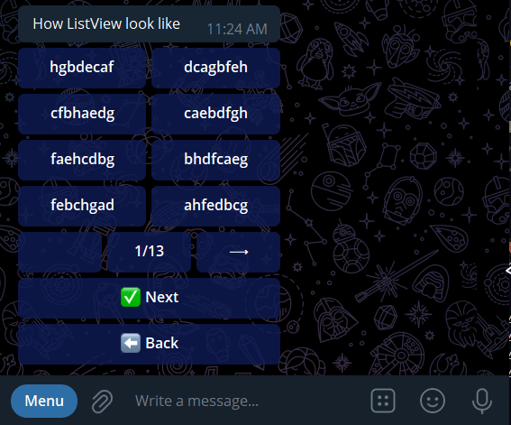

# Inline buttons list view for **aiogram**

## Looks like

``` python
chats = [
    "".join(random.sample("abcdefgh", 8)) 
    for _ in range(100)
]
buttons = (
    InlineKeyboardButton(
        "✅ Next",
        callback_data="next"
    ),
    InlineKeyboardButton(
        "⬅ Back",
        callback_data="back"
    )
)
lv = ListView(chats, 2, buttons=buttons)
keyboard = lv.get_page()
lv.register_handlers(dispatcher)
await bot.send_message(
    123456,
    "How ListView looks like",
    reply_markup=keyboard
)
```

## Usage
``` python
lv = ListView(
    items=chats,  # Iterable list of items which should be displayed
    row_width=2,  # Default: 1. How many items should be displayed in a row
    is_enumerate=True,  # Default: False. Should items be enumerated
    buttons=buttons  # Default: []. list of buttons which should be displayed below, after ListView's buttons
)

keyboard = lv.get_page()  # Get the first page
lv.register_handlers(dp)  # Register handlers for ListView's buttons: arrow left, arrow right, current page etc

# Then just put keyboard to reply_markup
```